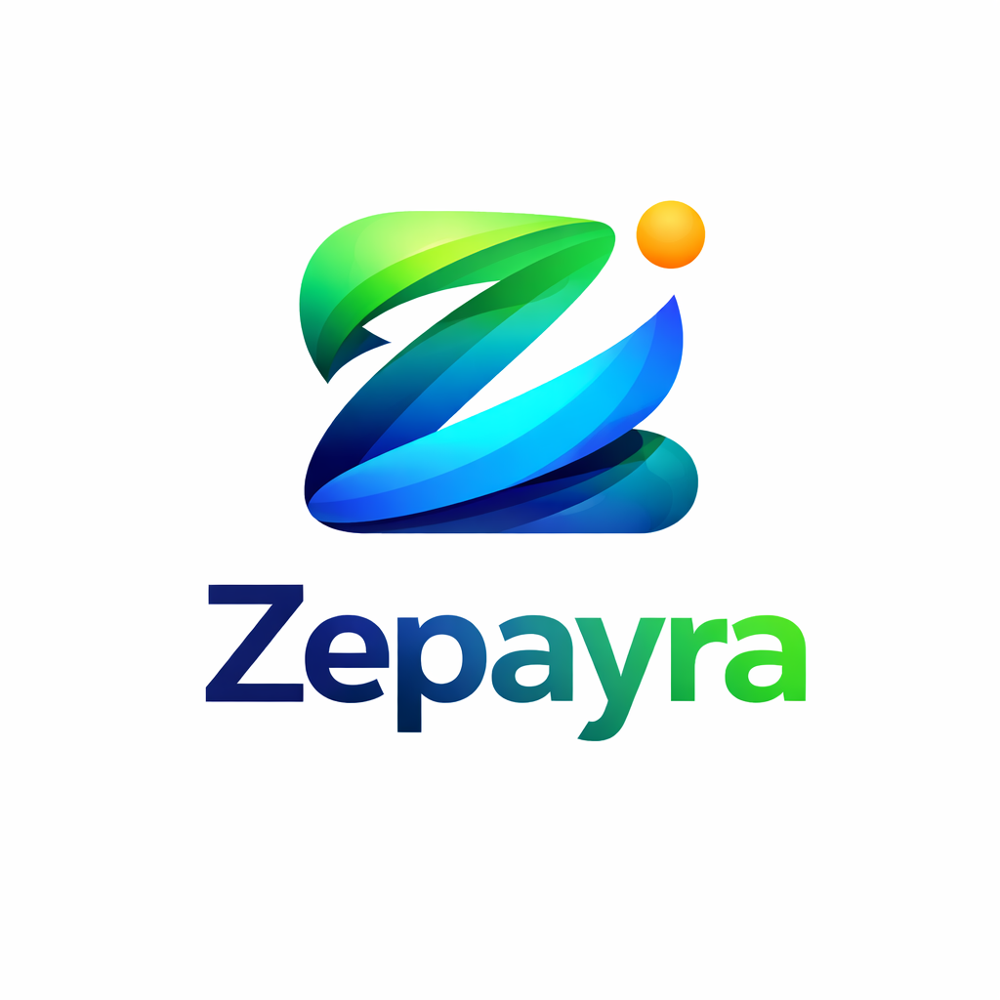

  

# Zepayra Documentation

**Version:** 2.0.0  
**Frontend URL:** [https://zepayra-frontend.onrender.com](https://zepayra-frontend.onrender.com)  
**Backend URL:** [https://zepayra-backend.onrender.com](https://zepayra-backend.onrender.com)  
**GitHub Repository:** [https://github.com/Kboy2000/Zepayra.git](https://github.com/Kboy2000/Zepayra.git)  
**Last Updated:** February 25, 2026

---

## 🚀 Executive Summary

**Zepayra** is a premium Nigerian fintech super-app designed for seamless digital financial services. Following a comprehensive "Premium Upgrade" phase, the platform now offers state-of-the-art spending analytics, robust savings management, and a highly polished UI that delivers a top-tier user experience across both light and dark themes.

---

## 📂 Technical Architecture

### Modern Tech Stack
- **Frontend:** React 19 (Vite) + Framer Motion (Animations) + Recharts (Analytics)
- **Backend:** Node.js + Express.js
- **Database:** MongoDB (Mongoose)
- **Deployment:** Dockerized architecture on Render
- **Theming:** Advanced CSS Variable system for high-contrast accessibility

---

## ✨ Key Features & Recent Enhancements

### 1. 📊 Spending Analytics (Premium)
- **Interactive Data Visualization:** Real-time charts showing spending patterns and category-wise breakdowns.
- **Insights Engine:** Personalized financial monitoring directly on the dashboard.

### 2. 🏦 Savings Vaults (New)
- **Goal-Oriented Savings:** Create specialized vaults for specific financial goals (e.g., Emergency Fund, Gadgets).
- **Target Tracking:** Set progress targets and deadlines with automated percentage tracking.
- **Auto-Save Toggle:** One-tap automation to enable/disable periodic savings.

### 3. 👥 Beneficiary Management 2.0
- **Polished Contact List:** Replaced legacy designs with professional, card-based beneficiary management.
- **Service Integration:** Automatic detection and sorting of recipients into Airtime, Data, and Utility categories.
- **Recent Recipients:** Persistent storage of your most frequent transaction partners for instant access.

### 4. 🌙 Theme Stability & UX Polish
- **Full Theme Fidelity:** Systematic project-wide audit ensured 100% visibility of all text, labels, and icons in both Light and Dark modes.
- **Blank Page Resolution:** Major structural fixes to `Airtime` and `Electricity` modules to eliminate runtime crashes and path corruption.
- **Personalized Experience:** Dynamic dashboard greetings and fixed routing for core actions like "Fund Wallet".

---

## 🛠️ Deployment & DevOps

The project utilizes a **Dockerized Blueprint** for consistent deployment across environments.

### Render Configuration
- **Blueprint Profile:** Managed via `render.yaml`
- **Frontend Service:** Static site served with Nginx
- **Backend Service:** Web service with Node.js
- **Health Checks:** Automated monitoring to ensure high availability

---

## 📖 API Endpoints (Core)

| Endpoint | Method | Description |
|----------|--------|-------------|
| `/api/auth/login` | `POST` | Secure JWT-based entry |
| `/api/wallet/balance` | `GET` | Real-time balance retrieval |
| `/api/services/airtime` | `POST` | Instant airtime purchase |
| `/api/services/electricity` | `POST` | Utility payment with validation |
| `/api/vaults` | `GET/POST`| Savings vault management |

---

## ⚖️ License
MIT License.

---
**Made with ❤️ for fintech innovation in Nigeria.**
